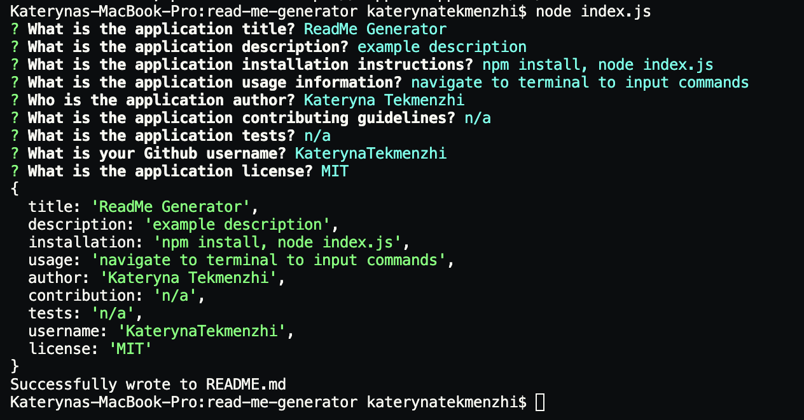

# Professional README Generator

  ## Description
  This application provides project creators a quick and professional way to create a README file. This process is beneficial for time management and efficiency 

  ## Table of Contents
  * [Installation](#installation)
  * [Usage](#usage)
  * [Author](#author)
  * [License](#license)
  
  ## Installation
  To install the dependencies (Inquirer package), run `npm install` in your command line. 
  Use the command `node index.js` in a terminal.

  ## Usage
  

  See video for a *[walkthrough](https://drive.google.com/file/d/1Me5aPrKBqN6-UT8CuIdk-vPLw7CIFuLN/preview)

  ## Author

  My file repository in GitHub is [here](https://github.com/KaterynaTekmenzhi/read-me-generator)

  ## License

